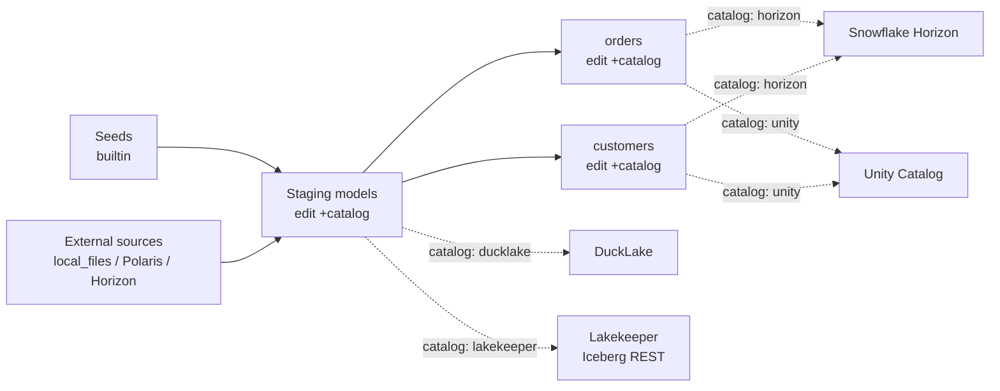

# DuckDB Catalog Capability Demo

This branch keeps the demo as the normal jaffle-shop DAG. Catalog behavior is
controlled by model config, not by separate proof-only models or profile
targets.

## Shape

- `catalogs.yml` contains the catalog definitions used by the demo: Lakekeeper,
  Polaris, Snowflake Horizon, Databricks Unity Catalog, DuckLake, and local
  files.
- `profiles.yml` has one DuckDB target: `catalog_demo`.
- `profiles.yml` does not use DuckDB `attach:` blocks; catalog attachment comes
  from `catalogs.yml`.
- `dbt_project.yml` defaults model writes to the built-in DuckDB catalog.
- To move a layer, edit that layer's `+catalog` in `dbt_project.yml` to one of
  the names in `catalogs.yml`.

The important demo knob is `catalog`, for example:

```yaml
models:
  jaffle_shop:
    orders:
      +catalog: horizon
```

## Catalog Flow



## Runtime

Use the fs debug binary from the stacked Fusion branches:

```bash
export DBT=/Users/dataders/Developer/fs/target/debug/dbt
```

Start Lakekeeper, Postgres, and MinIO for the local writable Iceberg REST
catalog:

```bash
docker-compose up -d
```

Replace the placeholder remote endpoints and warehouses in `catalogs.yml` before
running against Polaris, Horizon, or Unity Catalog. Keep only secret values in
the environment:

```bash
export POLARIS_CLIENT_ID=...
export POLARIS_CLIENT_SECRET=...
export POLARIS_OAUTH2_SERVER_URI=...

export HORIZON_PAT=...
export HORIZON_OAUTH2_SERVER_URI=...
export HORIZON_OAUTH2_SCOPE="session:role:<role>"

export DATABRICKS_TOKEN=...
```

`HORIZON_PAT` is a personal access token (`PAT`) that has access to the
Snowflake Horizon catalog.

## Runs

Default run, all jaffle models in built-in DuckDB:

```bash
$DBT seed --profiles-dir . --target catalog_demo --no-partial-parse
$DBT run --profiles-dir . --target catalog_demo --no-partial-parse
```

Move the staging layer to Lakekeeper and marts to Horizon by editing
`dbt_project.yml`:

```yaml
models:
  jaffle_shop:
    staging:
      +catalog: lakekeeper
    orders:
      +catalog: horizon
    customers:
      +catalog: horizon
```

Then run:

```bash
$DBT run --profiles-dir . --target catalog_demo --full-refresh --no-partial-parse
```

Move the whole DAG to DuckLake by setting the top-level and layer `+catalog`
values to `ducklake` in `dbt_project.yml`.

Read source tables routed through catalog definitions:

```bash
$DBT run --profiles-dir . --target catalog_demo \
  --select stg_local_file_orders --no-partial-parse

$DBT show --profiles-dir . --target catalog_demo \
  --inline 'select count(*) as rows from polaris.sql_server_covid19.us_states' \
  --output json --no-partial-parse

$DBT show --profiles-dir . --target catalog_demo \
  --inline 'select count(*) as rows from horizon.ICEBERGRESTPARTITIONBY.MANAGED_TABLE' \
  --output json --no-partial-parse
```

## Current Capability Notes

| Catalog | Demo role | Status |
| --- | --- | --- |
| Built-in DuckDB | Default write target | Works as the default `builtin` catalog. |
| Local DuckLake | Optional write target | Works through `catalog: ducklake`. |
| Local files | Source catalog | `source('local_files', 'raw_orders')` declares the local filesystem source. |
| Lakekeeper | Writable Iceberg REST target | Works for DuckDB/Fusion writes when the local service is running. |
| Polaris | Read-only source catalog for this demo | Reads work; do not use it as a write target in the conference demo. |
| Snowflake Horizon | Writable Iceberg REST target | Writes require a Horizon schema with a default external volume and DuckDB CTAS fallback to create-then-insert. |
| Databricks Unity Catalog | Writable Iceberg REST target | Writes require the patched DuckDB-Iceberg branch with the manifest schema-header and UC vended-credential fixes. |

Unity Catalog with Delta tables would be a useful follow-up demo. This branch
does not add it because current Fusion catalog validation accepts
`table_format: default` and `table_format: iceberg`, not `delta`.

The DuckDB-Iceberg demo extension branch is
`dataders/codex/demo-horizon-uc-write-compat`.

## Source Declarations

`models/sources.yml` declares Polaris, Horizon, and local filesystem sources.
That keeps read-only catalog access in dbt source definitions instead of
embedding direct three-part names throughout the model DAG.

## Stack Pointers

- fs PR #10457: conference catalog routing demo base.
- fs PR #10464: DuckDB Snowflake Horizon catalog support.
- fs PR #10478: DuckDB Unity Catalog attachment support.
- DuckDB-Iceberg branch `codex/demo-horizon-uc-write-compat`: Horizon write
  compatibility plus Unity Catalog write fixes.
